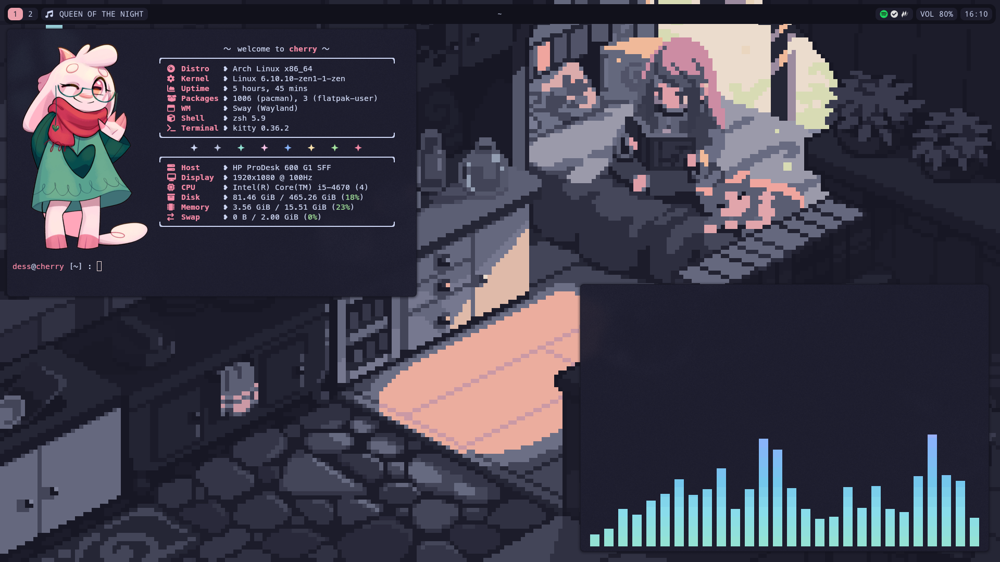

<h1>dotfiles</h1>
My personal configuration files for Arch Linux.

## Information
- **WM**: [SwayFX](https://github.com/WillPower3309/swayfx)
- **Status Bar**: [Waybar](https://github.com/Alexays/Waybar)
- **Terminal**: [Kitty](https://sw.kovidgoyal.net/kitty)
- **Shell**: [Zsh](https://zsh.org/) (+ [Oh My Zsh](https://ohmyz.sh/))
- **Editor**: [VSCodium](https://vscodium.com/), [Neovim](https://neovim.io/) (+ [lazy.nvim](https://lazy.folke.io/))
- **Launcher**: [Wofi](https://hg.sr.ht/~scoopta/wofi)

### Missing files (need more work)
- Neovim config (`~/.config/nvim/*`)

## Credits
### Theme
The color palette used across this repository is [Catppuccin](https://catppuccin.com/). Whenever possible, I included the respective license for each port that's used.
### Wallpapers
- **[Arch Linux](./waypaper/wallpapers/Arch%20Linux.png)**: Custom, based on a design by [1_mmm](https://discord.com/users/602832090949746710).
- **[Doukutsu Monogatari](./waypaper/wallpapers/Doukutsu%20Monogatari.png)**: Custom, based on artwork from [Cave Story](https://cavestory.org/).
- **[Reading](./waypaper/wallpapers/Reading.png)**: Taken from [orxngc/walls-catppuccin-mocha](https://github.com/orxngc/walls-catppuccin-mocha).
- **[Sushi](./waypaper/wallpapers/Sushi.jpg)**: Taken from [orxngc/walls-catppuccin-mocha](https://github.com/orxngc/walls-catppuccin-mocha).
### Miscellaneous
- Artwork used in fetch was taken from [daily ralsei](https://dailyralsei.straw.page/) (AKA [angle](https://itsalsoangle.straw.page/)).
- [quantumfate/wofi](https://github.com/quantumfate/wofi) was used as a reference for styling Wofi.